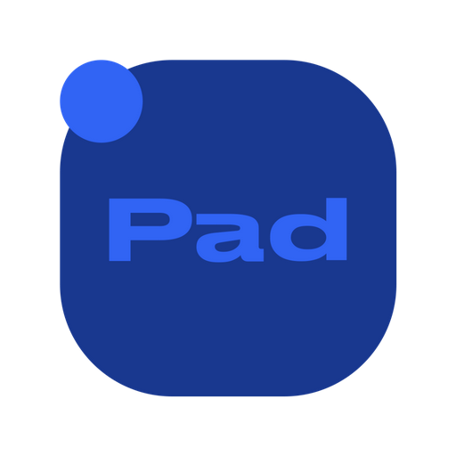
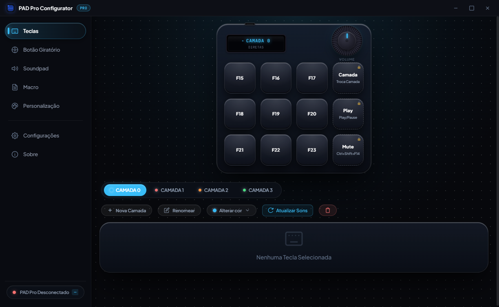
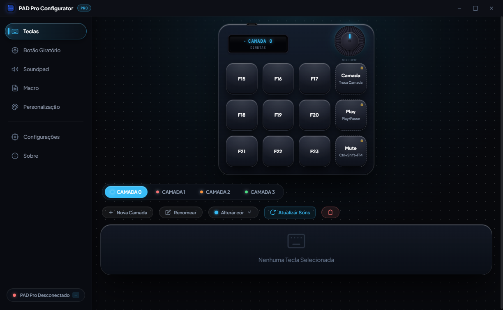
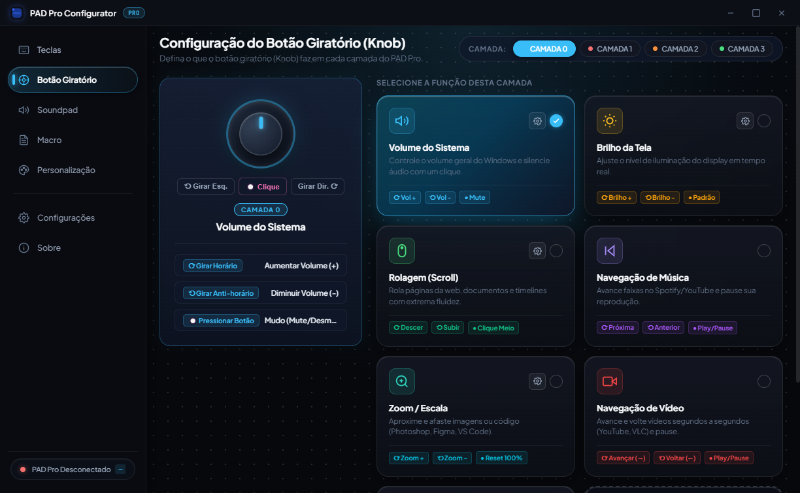
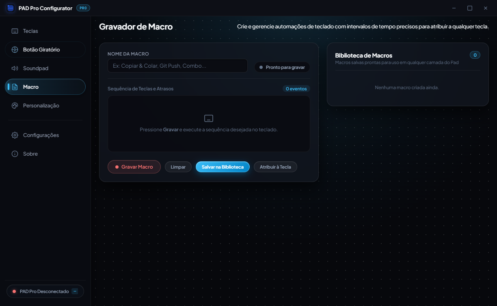

# 🎛️ PAD Pro — Central de Configuração & Macro Pad

<p align="center">
  
</p>

<p align="center">
  <strong>Configurador desktop oficial e intuitivo para o macro pad mecânico PAD Pro baseado em Raspberry Pi Pico (RP2040).</strong>
</p>

<p align="center">
  <a href="https://github.com/brunogbrl/pad-pro/releases/latest"></a>
  
  
  
  
  
</p>

<p align="center">
  <a href="https://github.com/brunogbrl/pad-pro/releases/download/v1.0.9/PAD-Pro-Setup-1.0.9.exe">
    
  </a>
</p>

---

## 📖 Visão Geral

O **PAD Pro** é uma solução completa de hardware e software que combina um teclado mecânico auxiliar (*macro pad*) de 12 teclas, display OLED e botão giratório (*rotary knob*) com um aplicativo de configuração visual em tempo real para Windows.

Integrado ao **CircuitPython**, o PAD Pro permite personalizar teclas, macros, sensibilidade do encoder e modos do display instantaneamente via comunicação serial USB — sem necessidade de reprogramar o microcontrolador manualmente.

---

## 📸 Interface do Aplicativo (Screenshots)

### 1. Mapeamento Visual de Teclas & Grade 3x4
Visualize o estado de cada tecla, atribua atalhos simples, combos e ações de toque vs. segurar (*hold action*), além de acompanhar a pré-visualização em tempo real do display OLED.

<p align="center">
  
</p>

---

### 2. Criação Inteligente de Novas Camadas (Layers)
Adicione camadas personalizadas definindo nome, cor de destaque, preenchimento com atalhos de fábrica padronizados (F13–F24 com modificadores sequenciais) e comportamento dedicado para o botão giratório (Knob).

<p align="center">
  
</p>

---

### 3. Botão Giratório Multi-função (Rotary Knob)
Defina o comportamento do botão giratório de forma independente para cada camada: **Navegação de Camadas**, **Volume do Sistema**, **Controle de Brilho**, **Rolagem (Scroll)**, **Navegação de Música**, **Zoom** ou ações personalizadas com rotação horária (CW), anti-horária (CCW) e clique.

<p align="center">
  
</p>

---

### 4. Gerenciador de Macros com Atribuição Visual
Grave ou edite sequências complexas de teclas e atribua diretamente a qualquer tecla do PAD Pro através de um assistente interativo com grade 3x4 e escolha entre clique rápido (*tap*) ou clique longo (*hold*).

<p align="center">
  
</p>

---

### 5. Personalização Visual: OLED & HUD Flutuante
Ajuste elementos visuais do display OLED (divisores, ícones dinâmicos, indicadores de camada), efeitos luminosos no aplicativo e o HUD flutuante translúcido para exibição discreta durante jogos e trabalho.

<p align="center">
  
</p>

---

## 🚀 Recursos Principais

- **🗂️ Sistema Multi-Camadas Ilimitado**: Crie quantas camadas desejar com temas de cores, rótulos e perfis independentes.
- **🔄 Navegação por Camadas no Knob**: Gire o botão giratório para alternar camadas suavemente e clique para voltar instantaneamente à Camada 0.
- **⚡ Atalhos de Fábrica Inteligentes**: Padronização sequencial com teclas estendidas `F13` a `F24` e modificadores (`Alt`, `Ctrl`, `Shift`, `Win`) livres de conflito com jogos e programas.
- **🔒 Teclas Físicas Fixas (Coluna 4)**:
  - **B3**: Alternar Camada
  - **B7**: Play / Pause
  - **B11**: Mute / Desmute Discord (`Ctrl + Shift + F14`)
- **🔁 Botão Resetar com Restauração de Fábrica**: Restaure qualquer tecla modificada de volta ao padrão exato de fábrica daquela camada com um único clique.
- **🔊 Integração Nativa com Soundpad**: Suporte a execução instantânea e pré-visualização ao segurar (*hold action*).
- **🎙️ Integração com Discord**: Atalhos dedicados para comunicação por voz.
- **🪟 HUD Flutuante Translúcido**: Notificação visual sempre que a camada ou o modo do encoder for alterado.
- **📦 Atualizador Automático (Auto-Updater)**: O aplicativo avisa, faz o download e aplica novas atualizações lançadas no GitHub automaticamente.

---

## 🛠️ Hardware Suportado

| Componente | Especificação |
| :--- | :--- |
| **Microcontrolador** | Raspberry Pi Pico (RP2040) |
| **Firmware** | CircuitPython 9.x |
| **Teclas** | 12 Switches Mecânicos Hotswap (Grade 3×4) |
| **Display** | Tela OLED I2C 128×32 (Controlador SSD1306) |
| **Encoder** | Encoder Rotativo EC11 com botão central de clique |
| **Conexão** | USB-C com protocolo HID Keyboard, Consumer Control e Mouse |

---

## 🎨 Créditos do Gabinete 3D

O design físico e gabinete 3D do projeto é baseado no modelo **SuperPad**:
- 🌐 **Modelo 3D no MakerWorld**: [Superpad Cool Macropad no MakerWorld](https://makerworld.com/pt/models/1142984-superpad-cool-macropad#profileId-1145670)
- 👏 **Agradecimento especial**: Um grande obrigado ao **@Scrypty** pela criação e disponibilização deste gabinete 3D espetacular!

---

## 📥 Instalação

1. Acesse a aba de **[Releases](https://github.com/brunogbrl/pad-pro/releases/latest)**.
2. Baixe o instalador mais recente: `PAD-Pro-Setup-1.0.9.exe`.
3. Execute o instalador e siga as instruções na tela (você pode escolher a pasta de instalação e criação de atalho na Área de Trabalho).
4. Conecte o PAD Pro à porta USB e o aplicativo fará o reconhecimento automático!

---

## 💻 Desenvolvimento Local

Para executar o projeto a partir do código-fonte:

```bash
# Clone o repositório
git clone https://github.com/brunogbrl/pad-pro.git

# Acesse o diretório
cd pad-pro

# Instale as dependências
npm install

# Inicie o aplicativo em modo de desenvolvimento
npm start
```

---

## 📄 Licença

Este projeto está licenciado sob a licença **MIT** — consulte o arquivo [LICENSE](LICENSE) para obter detalhes.
