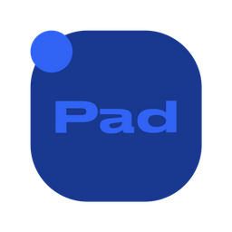

# 🎛️ PAD Pro — Central de Configuração & Macro Pad

<p align="center">
  
</p>

<p align="center">
  <strong>Configurador desktop oficial e intuitivo para o macro pad físico baseado em Raspberry Pi Pico.</strong>
</p>

<p align="center">
  
  
  
  
  
  
</p>

---

## 📖 Visão Geral

O **PAD Pro** é uma solução completa de hardware e software que combina um teclado mecânico auxiliar (*macro pad*) com um aplicativo de configuração visual em tempo real. Desenvolvido com **Electron**, **Node.js** e integrado ao **CircuitPython** da **Raspberry Pi Pico**, o aplicativo permite customizar cada tecla, o display OLED e o encoder giratório (*knob*) de forma rápida, moderna e sem necessidade de reprogramar o microcontrolador manualmente.

---

## 🚀 Principais Funcionalidades

- **🗂️ Sistema Multi-Camadas (Layers)**: Suporte a camadas independentes (Camada 0 a 3+) com perfis customizáveis, nomes de exibição e temas de cores personalizados para cada camada.
- **🔄 Sincronização Serial em Tempo Real**: Comunicação bidirecional direta via porta serial (USB) com a Raspberry Pi Pico. Qualquer alteração feita no app reflete no dispositivo instantaneamente.
- **🎚️ Controle Avançado do Knob (Rotary Encoder)**:
  - Modos pré-configurados: Volume, Scroll, Zoom, Faixa de Mídia, Controle de Brilho e Navegação de Camadas.
  - Funções customizadas com gravação de atalhos e ações distintas para: **Girar Horário (CW)**, **Girar Anti-horário (CCW)** e **Clique do Knob**.
- **📺 Simulador OLED Interativo**: Visualização fiel no aplicativo exatamente do que está sendo exibido na tela OLED física do hardware.
- **⚡ Gravador e Biblioteca de Macros**: Crie sequências complexas de teclas e atalhos com temporizações precisas para automação de tarefas e jogos.
- **🔊 Integração Nativa com Soundpad**: Leitura em tempo real da biblioteca de sons e reprodução rápida no toque ou pré-visualização ao segurar.
- **🎙️ Integração com Discord RPC**: Acompanhe o status da chamada de voz e alterne mute/desmute diretamente pelo PAD Pro.
- **🪟 HUD Flutuante Translúcido**: Notificação sutil na tela sempre que a camada ou o estado do PAD Pro for alterado, sem atrapalhar seus jogos ou trabalho em tela cheia.
- **📦 Instalador Oficial & Atualizações Automáticas**: Instalador inteligente do Windows com atalhos e central integrada que busca, baixa e instala novas versões diretamente do GitHub.

---

## 🌟 O Que Há de Novo (What's New)

Acompanhe as novidades e a evolução contínua do projeto:

### 🚀 [v1.0.5] — Em Breve (Próximo Lançamento)
- **Central de Atualizações Automáticas (Auto-Updater)**:
  - Sistema inteligente de verificação de atualizações ao vivo conectado às Releases do GitHub.
  - Janela modal interativa com notas da nova versão e barra de progresso do download em tempo real.
  - Instalação automática com um clique e reinício suave da aplicação.
- **Instalador Oficial para Windows (NSIS)**:
  - Geração de pacote instalável profissional com atalho na Área de Trabalho e inicialização do sistema.
- **Pipeline de Integração Contínua (GitHub Actions)**:
  - Compilação automatizada nas máquinas da nuvem a cada nova tag de versão publicada.

---

### 💎 [v1.0.4] — Versão Atual Estável
- **Novo Módulo de Personalização Visual**:
  - Opções completas de ajuste do display OLED: alternância de exibição de camadas, timeout de tela e modos de descanso.
  - Personalização de efeitos no aplicativo: brilho dinâmico (*glow*), texto corrido (*marquee*) e transições animadas.
- **Sincronização Bidirecional Aprimorada**:
  - Detecção imediata de conexão e reconexão automática da porta serial.
  - Monitoramento de logs em tempo real para depuração técnica.
- **Melhorias de Estabilidade**:
  - Otimização do consumo de memória e ciclo de vida do processo em segundo plano (Bandeja do Sistema / System Tray).

---

### 🛠️ [v1.0.3]
- **Integração com Soundpad**:
  - Suporte à leitura de atalhos de áudio diretamente do cache local do Soundpad.
  - Modo *preview* de áudio mantendo a tecla pressionada (*hold action*).
- **HUD Flutuante para Desktop**:
  - Criação do HUD compacto sempre no topo para sinalizar mudanças de camada e ações multimídia.

---

### ⚙️ [v1.0.2]
- **Gravador de Atalhos e Teclas**:
  - Interface visual para gravação rápida de teclas do teclado (combinações Ctrl, Alt, Shift, Win + Tecla).
  - Suporte às teclas estendidas de função F13 a F24.

---

### 🎨 [v1.0.1]
- **Redesign da Interface Gráfica**:
  - Adoção de visual escuro *premium* (Dark Mode moderno com glassmorphism).
  - Seletor de cores HSL para personalização da identidade de cada camada.
  - Ferramenta de exportação e importação de backups no formato `.json`.

---

### 📦 [v1.0.0]
- **Lançamento Inicial**:
  - Versão inicial do configurador desktop para o hardware Sharkropad Pro.
  - Suporte a CircuitPython e protocolo serial padrão.

---

## 🛠️ Instalação e Uso

### Para Usuários Finais (Windows)
1. Acesse a aba **[Releases](https://github.com/brunogbrl/pad-pro/releases)** no GitHub.
2. Baixe o instalador mais recente: `PAD-Pro-Setup-x.x.x.exe`.
3. Execute o instalador. O PAD Pro será instalado e criará um atalho na sua Área de Trabalho.
4. Conecte seu **PAD Pro** via cabo USB e o aplicativo detectará o dispositivo automaticamente!

---

## 💻 Desenvolvimento Local

Para clonar e executar o projeto em ambiente de desenvolvimento:

### Pré-requisitos
- [Node.js](https://nodejs.org/) versão 18 ou superior
- [Git](https://git-scm.com/)

### Passos:
```bash
# 1. Clone o repositório
git clone https://github.com/brunogbrl/pad-pro.git

# 2. Acesse a pasta do projeto
cd pad-pro

# 3. Instale as dependências
npm install

# 4. Inicie o aplicativo em modo de desenvolvimento
npm start
```

### Compilação do Instalador
Para gerar os arquivos executáveis e instaladores do Windows localmente:
```bash
# Gera o instalador oficial (NSIS)
npm run dist

# Gera a versão executável portátil (Portable)
npm run dist:portable
```
Os arquivos compilados estarão localizados dentro da pasta `dist/`.

---

## 🔌 Hardware & Firmware

O firmware que roda na **Raspberry Pi Pico** utiliza **CircuitPython** e está disponível na pasta `scripts/code.py`. 
Para conferir esquemas elétricos e tutoriais passo a passo:
- 📄 [Esquema de Ligação do Hardware (PDF)](Esquema_Ligacao_Sharkropad_Pro.pdf)
- 📄 [Tutorial Raspberry Pi Pico do Zero (PDF)](Tutorial_Raspberry_Pi_Pico_Do_Zero.pdf)

---

## 🎨 Design do Hardware & Créditos

O design físico e a modelagem 3D do case deste macro pad foram baseados no projeto **Superpad - Cool Macropad**:
- 🖨️ **Modelo 3D no MakerWorld**: [Superpad - Cool Macropad (MakerWorld)](https://makerworld.com/pt/models/1142984-superpad-cool-macropad#profileId-1145670)
- 🤝 Um agradecimento especial ao criador **[@Scrypty](https://makerworld.com/pt/@Scrypty)** pelo excelente design e contribuição com a comunidade Maker!

---

## 📄 Licença

Este projeto está sob a licença [MIT](LICENSE). Consulte o arquivo de licença para mais detalhes.

<p align="center">
  Desenvolvido com carinho para a comunidade Maker & Gamers 🚀
</p>
